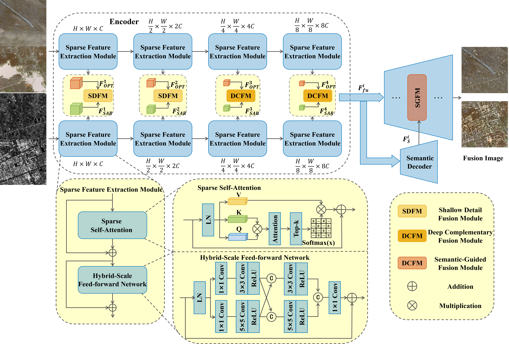

# SAMDFuse： Semantic-Aware Multi-Scale Degradation-Robust Fusion Network for SAR and Optical Images
[](https://pytorch.org/)
[](LICENSE)

Official implementation of the core architectural modules for **SAMDFuse**, a degradation-robust and semantic-aware framework for the fusion of Synthetic Aperture Radar (SAR) and optical imagery.

---
> **SAMDFuse: Semantic-Aware Multi-Scale Degradation-Robust Fusion Network for SAR and Optical Images**  
## 📖 Abstract
Robust fusion of synthetic aperture radar (SAR) and optical imagery is critical for improving the performance of downstream tasks, such as land classification and target monitoring. However, existing fusion frameworks exhibit limited capability to suppress the inherent speckle noise in SAR images and lack effective mechanisms for handling degradation factors in optical images, such as cloud occlusion. Additionally, most current fusion algorithms prioritize visual enhancement, providing limited benefits for downstream tasks. To address these limitations, we propose a degradation-robust and semantic-aware SAR–optical image fusion network with three main contributions. First, an encoder architecture is designed with Sparse Feature Extraction Module (SFEM) layers. SFEM integrates Sparse Self-Attention (SSA) with a Hybrid-Scale Feed-forward Network (HSFN) to suppress speckle noise and enhance stable cross-modal discriminative features. Second, a degradation-aware data augmentation strategy is developed by simulating realistic cloud occlusions, encouraging the network to learn complementary cross-modal information and improving its generalization under complex conditions. Third, Semantic-Guided Fusion Modules (SGFMs) inject multi-scale semantic features into the decoder, enabling the fused results to maintain spectral and structural consistency while better supporting downstream semantic segmentation. Experiments on the WHU-OPT-SAR dataset demonstrate that the proposed method outperforms state-of-the-art approaches such as FusionMamba and VSFF, achieving an structural similarity index (SSIM) of 0.968, a visual information fidelity (VIFF) of 0.498, and a mean intersection over union (mIoU) of 52.82\%. Consistent improvements are also observed on additional datasets, while robust structural preservation and semantic consistency are maintained under severe degradations.

## 🧠 Network Architecture

The overall architecture of SAMDFuse is illustrated below:

<div align="center">
    
</div>

### Key Contributions:
The proposed SAMDFuse framework consists of four key architectural components:

| Module | Full Name | Function |
|--------|-----------|----------|
| `SFEM` | Sparse Feature Extraction Module | Suppresses speckle noise and enhances discriminative features via sparse self-attention |
| `SDFM` | Shallow Detail Fusion Module | Fuses shallow features with detail preservation |
| `DCFM` | Deep Complementary Fusion Module | Performs self- and cross-attention for deep feature fusion |
| `SGFM` | Semantic-Guided Fusion Module | Modulates features using semantic priors (affine transform) |

---

## 🛠️ Core Modules Mapping

To facilitate peer review and support academic reproducibility, we provide the full implementation of the proposed core modules. The mapping between the manuscript and the source code is provided below:

| Module | Paper Section | Description | Implementation File |
| :--- | :--- | :--- | :--- |
| **SFEM** | Section 3.1 | Sparse feature extraction & noise suppression | `network/SFEM.py` |
| **SDFM** | Section 3.2 | Shallow detail calibration & channel aggregation | `network/fusion_modules.py` |
| **DCFM** | Section 3.2 | Deep feature fusion (Self + Cross Attention) | `network/fusion_modules.py` |
| **SGFM** | Section 3.3 | Spatially-adaptive semantic modulation | `network/SGFM.py` |

---

## 📂 Repository Structure
```text
SAMDFuse/
├── README.md # This file
├── LICENSE
├── requirements.txt # Dependencies
├── network/
│ ├── layers.py
│ ├── SFEM.py # Sparse Feature Extraction Module (incl. SSA, HSFN)
│ ├── MSFS.py # Multi-Scale Fusion Strategy (SDFM + DCFM)
│ └── SGFM.py # Semantic-Guided Fusion Module
└── images/
└── networkpipeline_V6.png
```
---

## 🚀 Quick Start

### Installation

```bash
git clone https://github.com/your-username/SAMDFuse.git
cd SAMDFuse
pip install -r requirements.txt
```
---

## 📝 Important Note on Code Release
This repository provides the core module implementations for clarity and reproducibility.
The complete training and evaluation pipeline (including data loaders, training loops, hyperparameter schedules, and the full fusion model) will be made publicly available upon final acceptance of the paper.

We believe that releasing these core components already fulfills the reproducibility requirements, as all novel architectural designs are fully disclosed. The full codebase is under active polishing to ensure high quality and ease of use for the community.

## 🖋️ Citation
If you find this work useful for your research, please consider citing our paper:
```bibtex
@article{wang2026samdfuse,
  title={SAMDFuse: Semantic-Aware Multi-Scale Degradation-Robust Fusion Network for SAR and Optical Images},
  author={Wang, Ruoxi and Li, Yinhe and Zhang, Enhua and Chen, Wanni and Wang, Kaizhi},
  journal={ISPRS Journal of Photogrammetry and Remote Sensing},
  note={Under review},
  year={2026}
}
